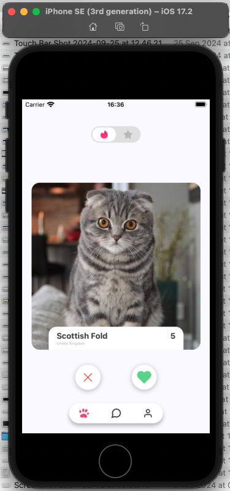

## CatTinder

CatTinder é um aplicativo React Native que permite aos usuários navegar e interagir com perfis de gatos. Este README fornece instruções detalhadas sobre como configurar, instalar e executar o projeto, além de informações sobre testes.


## Visão Geral do Projeto

CatTinder é construído usando React Native 0.75.3 e utiliza várias bibliotecas para navegação, gerenciamento de estado e componentes de UI. O projeto está configurado com TypeScript para segurança de tipos e Jest para testes unitários.

## Pré-requisitos

- Node.js (>=18)
- npm
- React Native
- Redux Toolkit
- Jest / React Native Testing Library
- Axios
- RN Swiper List
- Typescript

## Instalação

1. Clone o repositório:
   ```bash
   git clone https://github.com/yourusername/CatTinder.git
   cd CatTinder
   ```

2. Instale as dependências:
   ```bash
   npm install
   ```

3. Configure as variáveis de ambiente:
   Crie um arquivo `.env` no diretório raiz e adicione sua chave de API:
   ```env
   CATS_API_KEY=your_api_key_here
   ```

## Executando o Aplicativo

Para iniciar o aplicativo, execute os seguintes comandos:

Para iOS:
```bash
npm run ios
```

Para Android:
```bash
npm run android
```
## Testes

O projeto usa Jest e React Native Testing Library para testes unitários. Para executar os testes, use o seguinte comando:

```bash
npm test
```

## Dependências Principais

Para uma lista completa de dependências e dependências de desenvolvimento, consulte o arquivo `package.json`.

## Contribuindo

Por favor, leia o arquivo CONTRIBUTING.md (se disponível) para detalhes sobre nosso código de conduta e o processo para enviar pull requests.

## Capturas de Tela

### iOS


### Android

